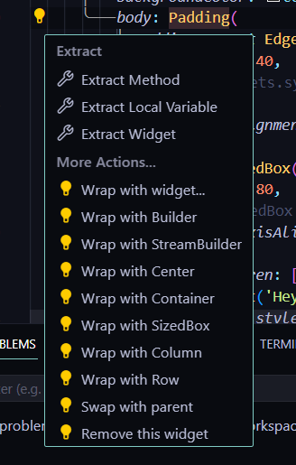

## vs code 설정

- "dart.previewFlutterUiGuides": true - 부모 자식 요소 관계 보여줌
- "source.fixAll": ture - 컴파일 타임에 계산될 수 있는 위젯은 자동으로 const 추가

## code actions

- 단축키: Ctrl + .
- 영역 선택 후 원하는 액션 적용할 수 있음
- 예: padding 적용
- wrap with widget: 일단 익명의 widget으로 감싸고 직접 작성할 수 있게 해 주는 옵션
